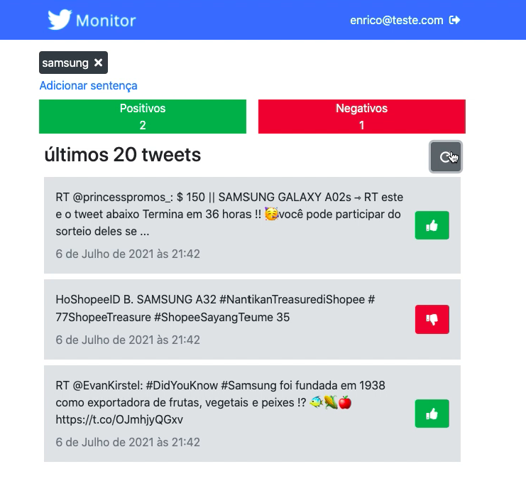
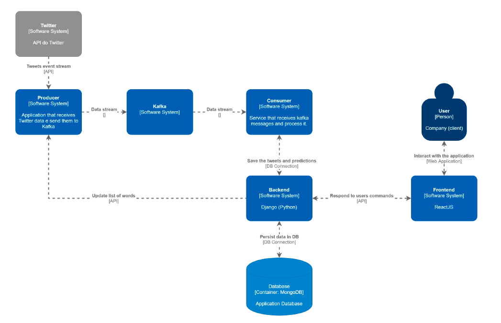

# Twitter Monitor

Este projeto utiliza a API do Twitter para monitoriar palavras-chave e realizar a análise de sentimentos.



## Arquitetura



Todos os tweets são consumidos da API do Twitter por um producer, que os envia para o Kafka. Então, os tweets são lidos da fila do Kafka por um consumer, que faz a análise de sentimentos baseada em um modelo de regressão linear treinado em uma base de avaliações de filmes do IMDB. Com a análise feita, os tweets são inseridos em uma base de dados em MongoDB, para serem lidos posteriormente pelo servidor web.

## Aplicação WEB

Para a interação com o sistema, o projeto utiliza um back-end em Django (Python) e um front-end em ReactJS. Pelo sistema, o usuário pode cadastrar grupos de palavras, em que cada grupo é possível cadastrar sentenças a serem monitoradas da API do Twitter, e por fim, pode visualizar a quantidade de tweets negativos e positivos referentes a cada um dos grupos.

## Artigo

<a href="./Paper.pdf">Link</a>

## Execução

### 1. Docker

Para executar, é necessário ter o Docker e o Docker-Compose instalado:

```
sudo apt-get install \
    apt-transport-https \
    ca-certificates \
    curl \
    gnupg \
    lsb-release

curl -fsSL https://download.docker.com/linux/ubuntu/gpg | sudo gpg --dearmor -o /usr/share/keyrings/docker-archive-keyring.gpg

echo \
	"deb [arch=amd64 signed-by=/usr/share/keyrings/docker-archive-keyring.gpg] https://download.docker.com/linux/ubuntu \
	$(lsb_release -cs) stable" | sudo tee /etc/apt/sources.list.d/docker.list > /dev/null

sudo apt-get update
sudo apt-get install docker-ce docker-ce-cli containerd.io

sudo curl -L "https://github.com/docker/compose/releases/download/1.29.2/docker-compose-$(uname -s)-$(uname -m)" -o /usr/local/bin/docker-compose
sudo chmod +x /usr/local/bin/docker-compose
```

---

### 2. Arquivos .env

Para a execução do projeto com o Docker, é necessário configurar os arquivos .env em cada uma das pastas (consumer, producer e web). Exemplo de cada um deles:

consumer:

```
KAFKA_PORT=8196
KAFKA_TOPIC=tweets
KAFKA_HOST=andromeda.lasdpc.icmc.usp.br
API_HOST=http://andromeda.lasdpc.icmc.usp.br:8195
```

producer:

```
API_KEY= ${TWITTER_API_KEY}
API_SECRET_KEY=${TWITTER_API_SECRET}
BEARER_TOKEN=${TWITTER_API_BEARER_TOKEN}
ACCESS_TOKEN=${TWITTER_API_ACCESS_TOKEN}
ACCESS_TOKEN_SECRET=${TWITTER_API_TOKEN_SECRET}
KAFKA_PORT=9092
KAFKA_TOPIC=tweets
API_HOST=http://andromeda.lasdpc.icmc.usp.br:8195
DOCKER_HOST_IP=andromeda.lasdpc.icmc.usp.br
```

- Os dados de API do twitter devem ser requisitados em: https://developer.twitter.com/

web:

```
DB_HOST=andromeda.lasdpc.icmc.usp.br
DB_PORT=27017
DB_USER=root
DB_PASSWORD=${DB_PASSWORD}
DJANGO_SUPERUSER_USERNAME=${DJANGO_USERNAME}
DJANGO_SUPERUSER_PASSWORD=${DJANGO_USER_PASSWORD}
DJANGO_SUPERUSER_EMAIL=${DJANGO_USER_EMAIL}
DATABASE_LOCATION=${LOCAL_DATABASE_PATH}
API_PORT=8000
```

- DB_PASSWORD: senha de acesso para o database
- DJANGO_USERNAME: login de usuário administrador do sistema
- DJANGO_USER_PASSWORD: senha do usuário administrador do sistema
- DJANGO_USER_EMAIL: email do usuário administrador do sistema
- LOCAL_DATABASE_PATH: caminho local para armazenamento do banco de dados

---

### 3. Arquivo de treinamento da análise de sentimento

Para o treinamento da IA de análise de sentimento, é necessário baixar o arquivo a seguir e colocar na pasta producer:
https://drive.google.com/file/d/1rvjv_Jub3VSgn0rzh2InLRfYvbazzBvd/

---

### 4. Executar via docker

consumer:

```
cd consumer
docker-compose up
```

producer:

```
cd producer
docker-compose up
```

web:

```
cd web
docker-compose up
```
